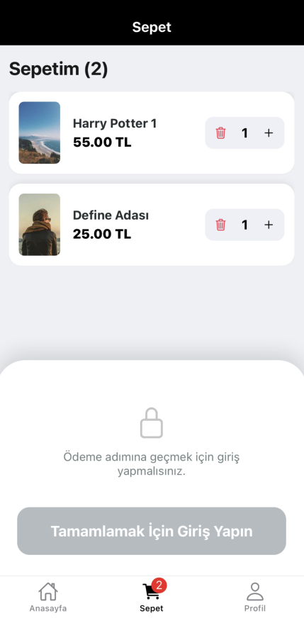
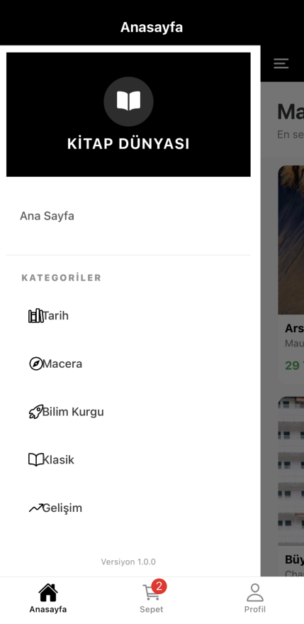

# 📚 Kitap Dünyası (Book World) - Mobile E-Commerce App

A professional, full-featured mobile e-commerce application built with **React Native (Expo)**, **TypeScript**, and **Firebase**. This project demonstrates a complete shopping lifecycle, from seamless authentication to product discovery, cart management, and a verified review system.

## 📱 Screenshots

<div style="display: flex; flex-direction: row; flex-wrap: wrap; gap: 10px;">
  
  
  
  
  
</div>

---

## ✨ Key Features

* **🔐 Secure Authentication:** Full Login, Registration, and Password Reset flows using Firebase Auth.
* **⚡ High Performance:** Implemented **Infinite Scroll (Pagination)** to load products efficiently from Firestore without performance lag.
* **🛒 Advanced Cart Management:** Powered by **Redux Toolkit**. Handles real-time price calculation, stock validation, and prevents math errors.
* **⭐ Social & Verified Reviews:**
    * Users can only review books they have **actually purchased**.
    * Includes **Edit/Delete** functionality for users' own comments.
* **🧭 Complex Navigation:** Seamless integration of **Stack**, **Bottom Tab**, and **Drawer** navigators.
* **👤 User Profile:** Management of saved addresses, payment cards, and order history.

## 🛠 Tech Stack

* **Framework:** React Native (Expo SDK 50+)
* **Language:** TypeScript
* **State Management:** Redux Toolkit
* **Backend:** Firebase (Authentication, Cloud Firestore)
* **Navigation:** React Navigation v6
* **UI/Styling:** StyleSheet, Vector Icons

---

## 🚀 Installation & Setup

To run this project locally, follow these steps:

### 1. Clone the repository
```bash
git clone [https://github.com/emreedemir/ShopTemplate.git](https://github.com/emreedemir/ShopTemplate.git)
cd ShopTemplate
2. Install Dependencies

Bash
npm install
# or
yarn install
3. Firebase Configuration (⚠️ Important)

This project relies on Firebase. You must create your own Firebase project and configure the environment variables.

Go to Firebase Console.

Create a project and add a "Web App".

Enable Authentication (Email/Password provider).

Enable Cloud Firestore and create a database.

Create a file named .env in the root directory and add your keys:

Kod snippet'i
API_KEY=your_api_key_here
AUTH_DOMAIN=your_project_id.firebaseapp.com
PROJECT_ID=your_project_id
STORAGE_BUCKET=your_project_id.firebasestorage.app
MESSAGING_SENDER_ID=your_sender_id
APP_ID=your_app_id
4. Run the App

Bash
npx expo start
📂 Project Structure
The codebase follows a modular and scalable structure:

Plaintext
src/
├── components/      # Reusable UI components (BookCard, BottomSheet, etc.)
├── constants/       # Global colors, strings, and layout constants
├── navigation/      # Navigation configurations (Tab, Drawer, Stack)
├── screens/         # Main application screens
├── services/        # Firebase API services (Auth, BookService, CommentService)
├── store/           # Redux slices (Cart, Auth) and store configuration
├── styles/          # Shared style definitions (Authentication styles)
└── types/           # TypeScript interface definitions
💡 Technical Highlights
Verified Review System Logic

To ensure the authenticity of reviews, the app checks the user's purchase history in the Redux state before allowing them to post a review.

TypeScript
// Logic to check if the user purchased the book
const hasPurchased = user?.orders?.some((order) => 
    order.items.some((item) => item.id === book.id)
);
Firestore Composite Indexes

The app uses complex queries (filtering by category AND sorting by date). This required setting up Composite Indexes in Firestore to ensure query performance and prevent execution errors.

📄 License
This project is open-source and available under the MIT License.
